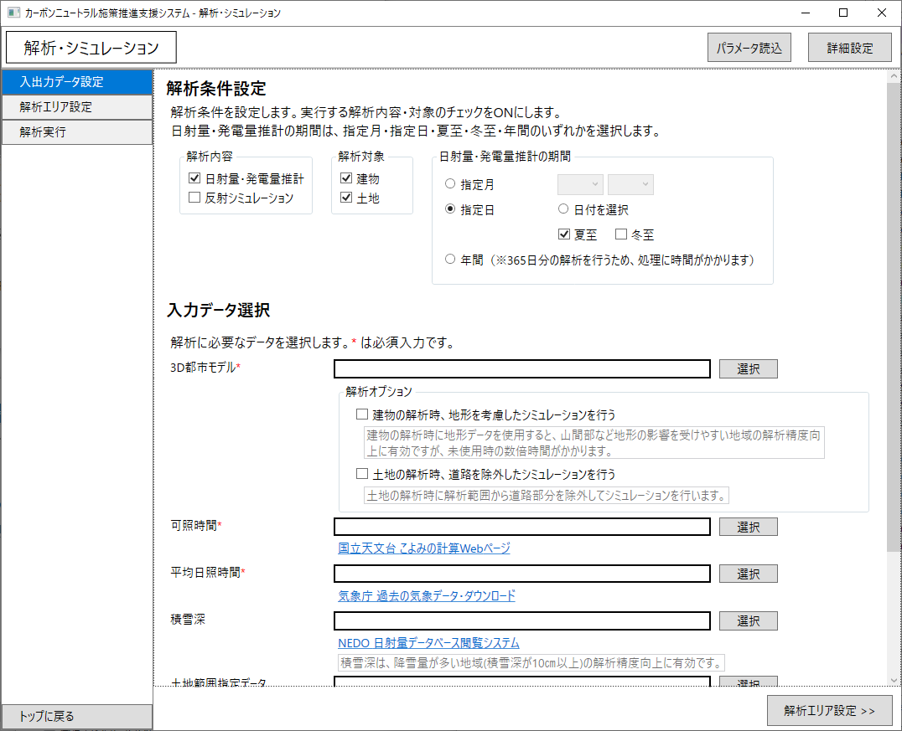

# カーボンニュートラル施策推進支援システム <!-- OSSの対象物の名称を記載ください。分かりやすさを重視し、できるだけ日本語で命名ください。英語名称の場合は日本語説明を（）書きで併記ください。 -->

 <!-- OSSの対象物のスクリーンショット（画面表示がない場合にはイメージ画像）を貼り付けください -->

## 更新履歴
| 更新日時 | リリース | 更新内容 |
| ---- | ---- | ---- |
| 2025/3/21 | 2nd Release | GUIの更新、土地の解析機能や解析エリア選択機能などを追加 |
| 2023/4/12 | 1st Release | 初版リリース |

## 1. 概要 <!-- 本リポジトリでOSS化しているソフトウェア・ライブラリについて1文で説明を記載ください -->
本リポジトリでは、Project PLATEAUの令和6年度のユースケース開発業務の一部であるUC24-15「太陽光発電のポテンシャル推計及び反射シミュレーション v3.0」について、その成果物である「カーボンニュートラル施策推進支援システム」のソースコードを公開しています。

「カーボンニュートラル施策推進支援システム」は、PLATEAUの3D都市モデルを活用し、太陽光発電ポテンシャルの推計・反射シミュレーション及び太陽光パネル設置の対象施設・エリアの適地判定を行うためのシステムです。

## 2. 「太陽光発電のポテンシャル推計及び反射シミュレーション v3.0」について <!-- 「」内にユースケース名称を記載ください。本文は以下のサンプルを参考に記載ください。URLはアクセンチュアにて設定しますので、サンプルそのままでOKです。 -->
「太陽光発電のポテンシャル推計及び反射シミュレーション v3.0」では、カーボンニュートラル施策推進のためのロードマップや計画の策定、太陽光発電を促進する重点エリアや将来の土地利用のあり方の検討などを支援し、地域のカーボンニュートラル施策を推進することを目的として本システムを開発しました。
本システムは、太陽光発電ポテンシャルの推計及び推計結果の建物屋根面への重畳、反射シミュレーション及び光害発生時間の推計といった解析シミュレーション機能に加えて、太陽光発電ポテンシャルの集計機能、建物構造や災害リスク等の条件に応じた太陽光パネル設置の適地判定機能を実装しています。
本システムは、行政職員向けのGUIを備えたオープンソースソフトウェアとしてフルスクラッチで開発されています。
本システムの詳細については[技術検証レポート](https://www.mlit.go.jp/plateau/file/libraries/doc/plateau_tech_doc_0110_ver01.pdf)を参照してください。

## 3. 利用手順 <!-- 下記の通り、GitHub Pagesへリンクを記載ください。URLはアクセンチュアにて設定しますので、サンプルそのままでOKです。 -->
本システムの構築手順及び利用手順については[利用チュートリアル](https://r5-plateau-acn.github.io/SolarPotential/)を参照してください。

## 4. システム概要 <!-- OSS化対象のシステムが有する機能を記載ください。 -->
### 【解析・シミュレーション】
#### ①日射量の推計機能
- 建物や土地ごとの指定した解析期間（夏至/冬至/指定日/指定月/年間）の日射量を推計します。
- 推計に当たり、日射量と3D都市モデルから算出した屋根や土地の傾斜・方位角を利用し、日照率・傾斜・方位条件による補正を行います。

#### ②発電ポテンシャルの推計機能
- 建物や土地ごとの発電量を推計します。解析期間は日射量推計した期間と同じ期間です。
- JIS C 8907:2005「太陽光発電システムの発電電力量推定方法」を参照し、以下の式で算出します。

EPY=P∗HAY∗KPY∗1/GS

EPY：予測発電量（kWh/期間）  
P：設置可能システム容量（推定）(kW)  
HAY：予測日射量（kWh/m^2・期間）  
KPY：基本設計係数 0.88 (有識者へのヒアリングを基に設定したREPOSでの値を活用)  
GS：標準試験条件による日射強度（kW・m^2）  

#### ③反射シミュレーション機能
- 建物・土地単位（パネルごと）の反射シミュレーションを実施し、建物に当たる反射光（反射点・到達点）を抽出します。
- アルゴリズムは近畿地方整備局研究発表会論文集に掲載されたU2076A「太陽光発電における光害検討の簡易化手法について」（2020年）を活用します。

#### ④光害発生時間の推計機能　
- 建物単位の光害発生時間を集計します。
- 指定した解析期間に応じて夏至、冬至、春分、指定日の1時間ごとに太陽光発電パネルへ太陽光が入射する場合の反射光を計算し、他の建物に当たるかを判定した上で、反射光が他の建物に到達した時刻を抽出し、その総和を光害発生時間とします。

### 【適地判定・集計】
#### ⑤発電ポテンシャルの集計機能
- 選択した範囲（エリア）内の建物について集計します。

#### ⑥太陽光パネル設置の適地判定機能
- 選択した範囲（エリア）において、重畳データ読み込み機能で読み込んだ各データ項目の値を集計し、あらかじめ設定した判断条件（災害リスク・パネル設置基準）と比較し、条件に該当する建物と土地を抽出します。

## 5. 利用技術

| 種別              | 名称   | バージョン | 内容 |
| ----------------- | --------|-------------|-----------------------------|
| ライブラリ      | [shapelib](https://github.com/OSGeo/shapelib) | 1.5.0 | シェープファイルの読み込みに利用するライブラリ |
|       | [OpenLayers](https://openlayers.org/) | 4.4.2 | ブラウザ上で地図データを表示・操作が可能なJavaScriptオープンソースライブラリ |
|       | [OpenCV](https://opencv.org/) | 4.10.0 | 画像処理・画像解析を行うライブラリ |

## 6. 動作環境 <!-- 動作環境についての仕様を記載ください。 -->
| 項目               | 最小動作環境                                                                                                                                                                                                                                                                                                                                    | 推奨動作環境                   | 
| ------------------ | ----------------------------------------------------------------------------------------------------------------------------------------------------------------------------------------------------------------------------------------------------------------------------------------------------------------------------------------------- | ------------------------------ | 
| OS                 | Microsoft Windows 10 または 11                                                                                                                                                                                                                                                                                                                  |  同左 | 
| CPU                | Intel Core i5以上                                                                                                                                                                                                                                                                                                                               | Intel Core i7以上              | 
| メモリ             | 8GB以上                                                                                                                                                                                                                                                                                                                                         | 16GB以上                        | 
| ディスプレイ解像度 | 1024×768以上                                                                                                                                                                                                                                                                                                                                    |  同左                   | 
| ネットワーク       | 範囲選択機能を使用する場合、以下のURLを閲覧できる環境が必要 ・地理院地図（国土地理院）　 http://cyberjapandata.gsi.go.jp ・地図表示のため標準地図 https://cyberjapandata.gsi.go.jp/xyz/std/{z}/{x}/{y}.png |  同左                            | 

## 7. 本リポジトリのフォルダ構成 <!-- 本GitHub上のソースファイルの構成を記載ください。 -->
| フォルダ名 |　詳細 |
|-|-|
| SRC/DLL/AggregateData | パネル設置適地判定のデータ管理 |
| SRC/DLL/AnalyzeData | 解析・シミュレーションのデータ管理 |
| SRC/DLL/Analyzer | 解析・シミュレーションの処理 |
| SRC/DLL/JudgeSuitablePlace | パネル設置適地判定の処理 |
| SRC/LIB/CommonUtil | SHPやGeoTIFFのデータ処理やファイル操作 |
| SRC/EXE/SolarPotential | GUI |
| SampleData | サンプルデータ |

## 8. ライセンス <!-- 変更せず、そのまま使うこと。 -->

- ソースコード及び関連ドキュメントの著作権は国土交通省に帰属します。
- 本ドキュメントは[Project PLATEAUのサイトポリシー](https://www.mlit.go.jp/plateau/site-policy/)（CCBY4.0および公共データ利用規約第1.0版）に従い提供されています。

## 9. 注意事項 <!-- 変更せず、そのまま使うこと。 -->

- 本リポジトリは参考資料として提供しているものです。動作保証は行っていません。
- 本リポジトリについては予告なく変更又は削除をする可能性があります。
- 本リポジトリの利用により生じた損失及び損害等について、国土交通省はいかなる責任も負わないものとします。

## 10. 参考資料 <!-- 技術検証レポートのURLはアクセンチュアにて記載します。 -->
- 技術検証レポート: https://www.mlit.go.jp/plateau/file/libraries/doc/plateau_tech_doc_0110_ver01.pdf
- PLATEAU WebサイトのUse caseページ「太陽光発電のポテンシャル推計及び反射シミュレーション v3.0」: https://www.mlit.go.jp/plateau/use-case/uc24-15/
